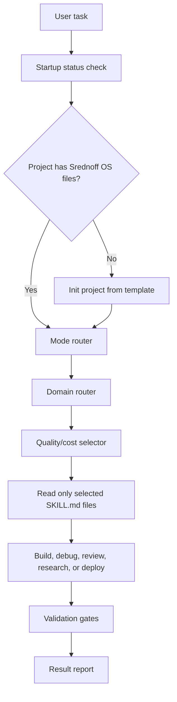
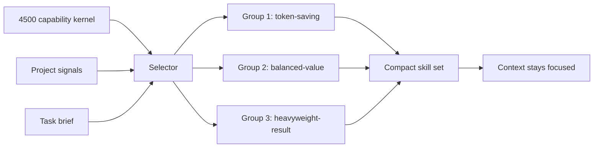
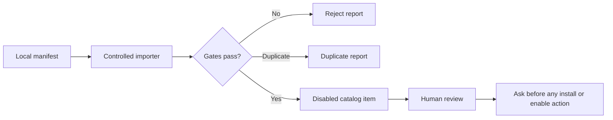

<p align="center">
  
</p>

<h1 align="center">Srednoff OS</h1>

<p align="center">
  <strong>A quality/cost-aware operating layer for Codex.</strong><br>
  Portable startup checks, skill routing, safety gates, source ranking, and regression evals for serious coding-agent work.
</p>

<p align="center">
  Created by <strong>Ivan Srednoff (Иван Среднёв)</strong><br>
  <a href="https://srednoff.agency">Srednoff.agency</a>
</p>

<p align="center">
  <a href="LICENSE"></a>
  <a href="https://github.com/srednoff888-art/srednoff-os/actions/workflows/ci.yml"></a>
  
  
  
  
</p>

<p align="center">
  <a href="#quick-start">Quick Start</a>
  |
  <a href="#system-map">System Map</a>
  |
  <a href="#capability-matrix">Capability Matrix</a>
  |
  <a href="#quality-evidence">Quality Evidence</a>
  |
  <a href="#safety-model">Safety</a>
  |
  <a href="QUALITY.md">Quality Log</a>
  |
  <a href="INSTALL.md">Install Guide</a>
</p>

---

## Executive Summary

Srednoff OS turns a fresh Codex session into a repeatable engineering workflow. It does not try to load every rule into context. It checks the project, selects the smallest useful skill set, routes the task by domain, applies safety gates, and records enough quality evidence to make the result auditable.

Current vNext implementation status is tracked in [.agent/SREDNOFF_OS_VNEXT_CHECKPOINTS.md](.agent/SREDNOFF_OS_VNEXT_CHECKPOINTS.md). Checkpoint 3 adds the public profile system so shared defaults, maintainer examples, agency workflows, and RU-market workflows stay separate from private local state.

| Problem in normal agent work | Srednoff OS response | Practical effect |
|---|---|---|
| Every project starts cold | Startup status check plus project bootstrap | Fewer half-configured sessions |
| Too many instructions waste context | 4500-record quality/cost selector with compact reads | Better ROI per token |
| UI/3D tasks copy risky assets too quickly | Design brief, source ranking, license/provenance gates | Safer component and asset reuse |
| Security checks are manual | Prompt/tool hooks plus independent security fixtures | Secrets and dangerous tool actions are blocked earlier |
| Hook decisions are vague | Explicit allow/ask/block security decisions with audit hash logging | Risky actions require user confirmation or are denied |
| Public core leaks personal defaults | Public profiles plus local-only private overlays | Shared repo stays portable and reviewable |
| Quality level is implicit | `fast`, `standard`, `production`, and `critical` quality modes | Validation cost matches task risk |
| RU-market work needs extra gates | `policies/*.yml` for RU data, payments, messaging, marketplaces, and NeuralDeep imports | Regulated or region-sensitive actions ask for review |
| RU workflows repeat across projects | Disabled `bundles/*.json` presets for RU SEO, marketplaces, 1C, payments, messaging, LLM, and DevOps | Selector gets better hints without loading long context |
| Specialist perspective is inconsistent | Disabled RU agent profiles linked to bundles, policies, and skills | Role-specific review without autonomous execution |
| CLI compatibility can become unsafe | RU wrappers search, audit, and recommend only; no silent installs | Safer bridge to future CLI workflows |
| External agent catalogs can be unsafe | Disabled NeuralDeep registry plus controlled metadata importer | Candidate tools stay inert until reviewed |
| README becomes too dense | Structured docs portal under `docs/` | Architecture, security, workflows, risk, RU/NeuralDeep, and validation are easier to review |
| Regressions are easy to miss | GitHub Actions CI plus local doctor/evals | Pull requests are checked automatically |
| Old sessions drift from the global rules | Sync scripts update existing Codex project folders with backups | New and old projects stay aligned |

## Quick Start

Clone the public package:

```bash
git clone https://github.com/srednoff888-art/srednoff-os.git
cd srednoff-os
```

Install globally:

```powershell
powershell -ExecutionPolicy Bypass -File ".\scripts\install-codex-md-os.ps1"
```

Initialize any project:

```powershell
powershell -ExecutionPolicy Bypass -File "$HOME\.codex\templates\codex-md-os\scripts\init-codex-project.ps1" "C:\path\to\project"
```

Verify:

```powershell
powershell -ExecutionPolicy Bypass -File "$HOME\.codex\scripts\srednoff-os-status.ps1" -ProjectPath "C:\path\to\project"
```

Expected output:

```text
Srednoff OS v2.1.2 loaded: OK | project=OK | skills=<count> | kernel=4500 | selector=True
```

## System Map





## Capability Matrix

| Layer | Files | What it does | Validation |
|---|---|---|---|
| Startup | `srednoff-os-status.ps1`, hooks | Confirms OS, project, skill count, kernel count, selector availability | `srednoff-os-doctor.ps1` |
| Bootstrap | `init-codex-project.*` | Installs project rules, skills, scripts, evals, and project skill index | Project status check |
| Sync | `sync-codex-skills-to-projects.ps1` | Updates old Codex folders from the current template with backups | Old-session doctor check |
| Profiles | `profiles/`, `srednoff-os-profile.ps1` | Separates public defaults, maintainer examples, agency workflows, and RU-market overlays | Profile fixtures and doctor check |
| Quality modes | `quality-modes.json`, `srednoff-os-quality-mode.ps1` | Maps task risk to budget, capability count, and validation gates | Quality mode fixtures and router coverage |
| Policies | `policies/*.yml`, `srednoff-os-policy-check.ps1` | Matches RU/NeuralDeep policy gates by brief and keeps default `ask` posture | Policy fixtures and doctor check |
| Bundles | `bundles/*.json` | Groups RU-market skills, domains, policy gates, and validation gates as disabled selector presets | Bundle fixtures and doctor check |
| Agent profiles | `agents/*.md` | Provides RU specialist lenses for SEO, marketplaces, 1C, enterprise, LLM, content, payments, and messaging | Agent profile fixtures and doctor check |
| RU CLI wrappers | `scripts/srednoff-os-ru-*.ps1` | Searches, audits, and recommends import/install commands without executing external installs | RU CLI fixtures and CI |
| NeuralDeep registry | `registry/neuraldeep/` | Holds disabled candidate skills, MCP servers, and CLI tools with provenance and trust metadata | Registry fixtures and doctor check |
| NeuralDeep importer | `integrations/neuraldeep/` | Imports local manifests as disabled metadata after license/provenance/dedupe checks | Importer fixtures and CI |
| Selector | `select-quality-cost-capabilities.ps1`, `quality-cost-skill-kernel` | Chooses compact capabilities by value per token | Selector fixtures |
| Routers | `srednoff-os-mode-router.ps1`, `srednoff-os-domain-router.ps1` | Routes normal/deep/TURBO and task domains | v2.1.1/v2.1.2 evals |
| UI/3D source ranking | `srednoff-os-design-brief.ps1`, `srednoff-os-source-ranker.ps1` | Ranks UI kits, design connectors, 3D libraries, and asset sources | Registry provenance validation |
| External prompt mining | `external-prompt-pattern-miner` | Extracts only safe, abstract agent patterns from prompt repos/leak archives | Selector fixture plus provenance review |
| Security hooks | `srednoff-os-hook.ps1` | Blocks high-confidence secrets/destructive actions, asks before publish/deploy/bypass actions, records redacted audit entries | Independent security fixtures |
| Donor research | `donor-research.json`, `validate-donor-research.ps1` | Keeps prompt-leak/source-donor research clean-room, provenance-first, and non-verbatim | Donor manifest validation |
| Documentation portal | `docs/*.md`, `validate-docs.ps1` | Splits architecture, security, workflows, profiles, risk, RU/NeuralDeep, and validation into reviewable pages | Docs validation |
| CI | `.github/workflows/ci.yml` | Runs validation on Windows and Ubuntu | GitHub Actions |
| Quality log | `QUALITY.md` | Tracks what is verified and what is not promised | Manual release gate |

## Quality Evidence

Current release gate, as recorded in [QUALITY.md](QUALITY.md):

| Check | Result | Command |
|---|---:|---|
| Doctor | 41/41 PASS | `.\scripts\srednoff-os-doctor.ps1 -ProjectPath . -RunEvals -FixSafe` |
| Selector evals | 11/11 PASS | `.\scripts\test-srednoff-os-selector.ps1` |
| v2.1.1 compatibility evals | 13/13 PASS | `.\scripts\test-srednoff-os-v211.ps1` |
| v2.1.2 routing/source evals | 12/12 PASS | `.\scripts\test-srednoff-os-v212.ps1` |
| Security fixture evals | 12/12 PASS | `.\scripts\test-srednoff-os-security-fixtures.ps1` |
| Profile evals | 4/4 PASS | `.\scripts\test-srednoff-os-profiles.ps1` |
| Quality mode evals | 5/5 PASS | `.\scripts\test-srednoff-os-quality-modes.ps1` |
| Policy evals | 5/5 PASS | `.\scripts\test-srednoff-os-policies.ps1` |
| Bundle evals | 9/9 PASS | `.\scripts\test-srednoff-os-bundles.ps1` |
| Agent evals | 8/8 PASS | `.\scripts\test-srednoff-os-agents.ps1` |
| RU CLI evals | 4/4 PASS | `.\scripts\test-srednoff-os-ru-cli.ps1` |
| NeuralDeep registry evals | 5/5 PASS | `.\scripts\test-srednoff-os-neuraldeep-registry.ps1` |
| NeuralDeep importer evals | 5/5 PASS | `.\scripts\test-srednoff-os-neuraldeep-importer.ps1` |
| Kernel validation | 4500 records PASS | `.\scripts\validate-quality-cost-kernel.ps1` |
| Source registry validation | 17 sources PASS | `.\scripts\validate-source-registry.ps1` |
| Donor research validation | 3 sources PASS | `.\scripts\validate-donor-research.ps1` |
| Docs validation | 8 files PASS | `.\scripts\validate-docs.ps1` |
| Skill metadata smoke | 308/308 PASS | `.\scripts\quick-validate-all-skills.ps1 -Mode fast` |

GitHub Actions adds:

| Runner | What it verifies |
|---|---|
| Windows | PowerShell parsing, PSScriptAnalyzer errors, kernel/source/donor/docs validation, eval suites, fast skill validation |
| Ubuntu | Bash syntax, ShellCheck, kernel/source/donor/docs validation, portable eval suites |

## Quality Modes

| Mode | Budget | Max capabilities | Use when | Default gates |
|---|---:|---:|---|---|
| `fast` | lean | 8 | tiny fixes, quick checks, low-risk docs | status, targeted check |
| `standard` | balanced | 16 | normal build/debug/review work | status, relevant tests, lint if present |
| `production` | deep | 24 | launch, deploy, SEO/PPC/growth, mobile, 3D | doctor, tests/build/lint, rollback and release risk |
| `critical` | deep | 32 | security, auth, data, payments, migrations, audits | security review, rollback, multi-pass review |

`TURBO` remains an explicit override and still requires the literal `TURBO` command.

## Documentation

The public documentation portal lives in [docs/README.md](docs/README.md).

| Topic | Link |
|---|---|
| Architecture | [docs/architecture.md](docs/architecture.md) |
| Security | [docs/security.md](docs/security.md) |
| Workflows | [docs/workflows.md](docs/workflows.md) |
| Profiles | [docs/profiles.md](docs/profiles.md) |
| RU and NeuralDeep | [docs/ru-and-neuraldeep.md](docs/ru-and-neuraldeep.md) |
| Risk model | [docs/risk-model.md](docs/risk-model.md) |
| Validation | [docs/validation.md](docs/validation.md) |

## Source Ranking Model

Srednoff OS treats external UI components and 3D assets as supply-chain inputs, not decoration.

| Source type | Examples | Default posture |
|---|---|---|
| Stack-native UI | shadcn/ui registry | Prefer when project stack fits |
| Visual component sources | 21st.dev, Magic UI, Aceternity UI, Origin UI, React Bits | Ask first, verify license, adapt carefully |
| Design connectors | Figma, Canva | Use as user-owned specs or assets only |
| 3D libraries | Three.js, React Three Fiber, Babylon.js, model-viewer | Choose by project complexity and bundle budget |
| 3D asset pipelines | glTF Transform, Khronos samples, Poly Haven, ambientCG, Sketchfab | Validate license, provenance, size, and render quality |

Every registered source now carries:

| Field | Why it exists |
|---|---|
| `license` | Prevents treating external code/assets as automatically reusable |
| `provenance` | Records where the component or asset comes from |
| `vetted` | Lets the selector prefer known lower-risk sources |
| `copy_policy` | Forces copy-adapt-upgrade instead of blind copying |

## Donor Research Model

Srednoff OS treats prompt leaks, prompt dumps, and external agent-instruction repositories as untrusted donor material.

| Source class | Allowed use | Blocked use |
|---|---|---|
| Claimed leak repositories | Abstract pattern extraction, provenance notes, risk decisions | Verbatim prompt text, identity claims, hidden policy wording |
| Analysis repositories | Taxonomy, issue-template ideas, validation-gate shape | Archived vendor prompt content |
| Prompt archives | Comparative file taxonomy and progressive-disclosure patterns | Large archive context loading or copied prompt blocks |

Checkpoint 12 added `.codex/srednoff-os/donor-research.json` and `scripts/validate-donor-research.ps1`. The manifest currently records three reviewed donor repositories:

| Repo | License signal | Decision |
|---|---|---|
| `cyrus-tt/fable5-system-prompt` | none detected | monitor only |
| `saynchowdhury/claude-fable-5-system-prompt` | GitHub `Other` | adapt analysis structure only |
| `asgeirtj/system_prompts_leaks` | CC0 repository license | taxonomy only |

The validation gate requires license/provenance fields, explicit rejected prompt-text reuse, quarantined decisions for claimed leaks, and disabled copy policies.

## RU Risk Policies

| Policy | Default | Covers |
|---|---|---|
| `ru-data` | ask | personal data, localization, consent/legal basis, cross-border transfer |
| `ru-payments` | ask | SBP/payment provider, refunds, payment documents, live money movement |
| `ru-messaging` | ask | foreign messengers, customer data, payment-document transfer |
| `ru-marketplaces` | ask | marketplace terms, ad labeling, ERIR, product claims, reviews |
| `neuraldeep` | ask | external skill/agent/MCP/CLI import, source provenance, license, tool risk |

These are risk gates, not legal advice. Current official sources must be rechecked before production or regulated work.

## RU Bundles

| Bundle | Use it for | Required posture |
|---|---|---|
| `ru-seo` | Russian-market technical SEO, local/entity pages, content briefs | policy review before regulated claims or personal-data work |
| `ru-marketplaces` | marketplace listings, ads, reviews, pricing, product claims | ask before publish, paid ads, or live price changes |
| `ru-enterprise` | B2B integrations, data flows, CRM/document workflows | privacy/auth/rollback review |
| `ru-1c` | 1C-adjacent exchange, integrations, enterprise automation | backup and operator review |
| `ru-llm` | Russian LLM/RAG/agent/MCP workflows | provenance, prompt-security, and secret-exfiltration review |
| `ru-content` | Russian editorial SEO, localization, claims, microcopy | editorial and claims review |
| `ru-payments` | billing, checkout, refunds, fiscal/payment documents | ask before live money movement |
| `ru-messaging` | notifications and customer communication | dry-run, recipient, and rate-limit review |
| `ru-devops` | deployment, env, observability, rollback, data residency | release and rollback gate |

Bundles are selector metadata. They do not install tools, enable agents, or replace human approval.

## RU Agent Profiles

| Agent | Linked bundle | Main lens |
|---|---|---|
| `ru-seo-agent` | `ru-seo` | technical SEO, local/entity pages, migrations |
| `ru-marketplaces-agent` | `ru-marketplaces` | listings, claims, ads, conversion |
| `ru-1c-agent` | `ru-1c` | 1C-adjacent exchange, operator workflows, rollback |
| `ru-enterprise-agent` | `ru-enterprise` | B2B architecture, data flows, auth, integrations |
| `ru-llm-agent` | `ru-llm` | LLM/RAG/agent imports, evals, prompt security |
| `ru-content-agent` | `ru-content` | editorial SEO, localization, microcopy, claims |
| `ru-payments-agent` | `ru-payments` | checkout, billing, refunds, payment documents |
| `ru-messaging-agent` | `ru-messaging` | customer messages, templates, notifications |

Agent profiles are compact role references. They do not start subagents or call connectors by themselves.

## RU CLI Wrappers

| Script | Mode | What it does |
|---|---|---|
| `srednoff-os-ru-search.ps1` | read-only | searches local RU bundles and agent profiles |
| `srednoff-os-ru-audit.ps1` | read-only | checks RU policies, bundles, agents, registry, and importer presence |
| `srednoff-os-ru-import.ps1` | recommendation-only | prints a safe NeuralDeep importer `-DryRun` command |
| `srednoff-os-ru-install.ps1` | blocked-without-confirmation | inspects candidates and lists required human gates |

The wrappers do not call package managers, install MCP servers, or execute external CLI commands.

## NeuralDeep Registry

| File | Role | Safety posture |
|---|---|---|
| `registry/neuraldeep/index.json` | Registry entrypoint | `enabled=false`, `auto_install=false` |
| `registry/neuraldeep/skills.json` | Skill candidates | disabled and unvetted |
| `registry/neuraldeep/mcp.json` | MCP server candidates | disabled and high-risk by default |
| `registry/neuraldeep/cli.json` | CLI candidates | disabled and high-risk by default |
| `registry/neuraldeep/trust-report.json` | Trust model | `trusted_for_execution=false` |
| `registry/neuraldeep/import-log.json` | Import event structure | records skeleton and controlled imports |
| `integrations/neuraldeep/import-neuraldeep-registry.ps1` | Controlled importer | local manifest in, disabled metadata out |

The registry and importer do not install anything. They store candidates for later review.



## Safety Model

This repository is a sanitized public export. It intentionally excludes real local state:

| Excluded | Reason |
|---|---|
| `$HOME/.codex/config.toml` | May contain local connector and trust settings |
| `hooks.state` | Runtime-local hook state |
| `.env` files | Secrets must never be published |
| Connector keys | Must stay in local secret stores |
| MCP inventory | Machine-specific and potentially private |
| Runtime caches | Not portable, not reviewable |
| Private local paths | Avoid leaking workstation/project structure |
| Private profile overlays | Keep owner/client defaults outside public git history |

Safety guardrails:

| Guardrail | Enforced by |
|---|---|
| Prompt secret preflight | `srednoff-os-hook.ps1` |
| Tool action preflight | `srednoff-os-hook.ps1` |
| Dangerous command blocklist | Hook fixture tests |
| Ask before external/bypass actions | `srednoff-os-hook.ps1` fixtures for force push and `--no-verify` |
| Redacted audit ledger | `events.jsonl` stores findings and input hash, not raw input |
| Home-root trust warning/fix | `srednoff-os-doctor.ps1 -FixSafe` |
| Registry provenance checks | `validate-source-registry.ps1` |
| CI regression checks | `.github/workflows/ci.yml` |

## What It Is Not

| Not promised | Reality |
|---|---|
| A stronger model | It is an operating layer around Codex behavior |
| Mathematical obedience | It improves routing, checks, and evidence, but cannot guarantee model behavior |
| A secret manager | It detects likely leaks, but secrets still belong in proper stores |
| A license clearing system | It records provenance and forces review; humans still approve legal risk |
| A reason to load all skills | The selector exists to keep context small |

## Inside The Box

| Path | What it contains |
|---|---|
| `AGENTS.md` | Global/project behavior contract for Codex |
| `code_review.md` | Review rules for bugs, security, performance, and maintainability |
| `.agent/` | Planning templates, quality gates, connector rules, release notes |
| `.agent/SREDNOFF_OS_CHECKPOINT_5_SECURITY_HOOK_RESEARCH.md` | Security hook source research and adaptation notes |
| `.codex/skills/` | 308 skill directories and agent profiles |
| `.codex/srednoff-os/` | Version metadata, source registry, source watchlist |
| `.codex/srednoff-os/quality-modes.json` | Fast, standard, production, and critical mode metadata |
| `profiles/` | Public profile metadata and sanitized overlay examples |
| `policies/` | RU and NeuralDeep policy gates |
| `bundles/` | Disabled RU domain bundle presets |
| `agents/` | Disabled RU specialist agent profiles |
| `registry/neuraldeep/` | Disabled NeuralDeep skills/MCP/CLI registry skeleton |
| `integrations/neuraldeep/` | Controlled NeuralDeep metadata importer |
| `scripts/` | Install, sync, status, doctor, selector, router, brief, ranking, RU wrappers, validation |
| `evals/` | Regression fixtures for selectors, routers, source ranking, and hook security checks |
| `hooks.example.json` | Portable hook example without private local state |
| `.github/workflows/ci.yml` | Windows and Ubuntu validation pipeline |

## Design Benchmark Notes

The README structure was benchmarked against strong public GitHub projects on 2026-07-02. Patterns were adapted, not copied.

| Repo | Why relevant | Pattern adapted | Risk avoided |
|---|---|---|---|
| [vercel/next.js](https://github.com/vercel/next.js) | Massive framework repo with concise positioning | Short hero, direct docs path | Do not copy brand language |
| [supabase/supabase](https://github.com/supabase/supabase) | Product-grade OSS platform README | Feature checklist, architecture section | Avoid unrelated hosted-platform claims |
| [microsoft/playwright](https://github.com/microsoft/playwright) | Tooling README with clear install matrix | Workflow-specific quick start table | Avoid large code tutorial in landing README |
| [shadcn-ui/ui](https://github.com/shadcn-ui/ui) | Design/tooling repo with strong visual identity | Minimal product promise and open-code stance | Avoid overclaiming component ownership |
| [langchain-ai/langchain](https://github.com/langchain-ai/langchain) | Agent platform README with ecosystem map | Ecosystem-style capability grouping | Avoid hype without validation evidence |

Decision:

| Adopt | Adapt | Avoid |
|---|---|---|
| Clear hero, badges, quality evidence, architecture diagrams | Tables for capabilities, safety, source ranking, and release gates | Long marketing copy, unsupported claims, hidden safety caveats |

## Best For

| User | Fit |
|---|---|
| Solo developer | Wants Codex to behave consistently across projects |
| Small team | Needs repeatable rules, quality gates, and public contribution hygiene |
| UI/UX or 3D web builder | Needs source ranking before copying components or assets |
| SEO/PPC/growth operator | Needs research discipline and validation gates |
| Automation-heavy workflow owner | Needs hooks, sync scripts, evals, and project templates |

## Contributing

Friends can open an issue with a skill idea, bug report, or improvement proposal. Keep contributions portable: no personal paths, no secrets, no private connector state.

See [CONTRIBUTING.md](CONTRIBUTING.md).

## License

MIT. See [LICENSE](LICENSE).
