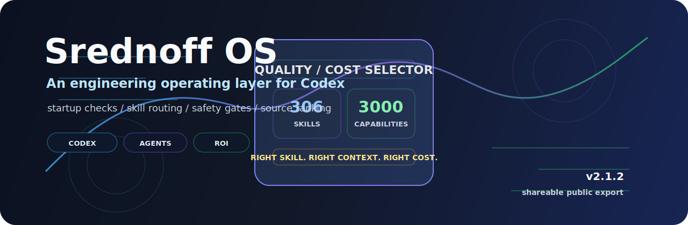
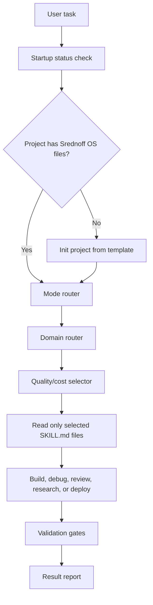
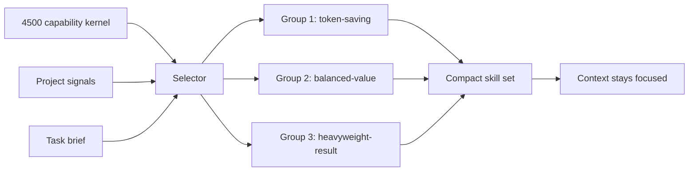

<p align="center">
  
</p>

<h1 align="center">Srednoff OS</h1>

<p align="center">
  <strong>A quality/cost-aware operating layer for Codex.</strong><br>
  Portable startup checks, skill routing, safety gates, source ranking, and regression evals for serious coding-agent work.
</p>

<p align="center">
  Created by <strong>Ivan Srednoff (Иван Среднёв)</strong><br>
  <a href="https://srednoff.agency">Srednoff.agency</a>
</p>

<p align="center">
  <a href="LICENSE"></a>
  <a href="https://github.com/srednoff888-art/srednoff-os/actions/workflows/ci.yml"></a>
  
  
  
  
</p>

<p align="center">
  <a href="#quick-start">Quick Start</a>
  |
  <a href="#system-map">System Map</a>
  |
  <a href="#capability-matrix">Capability Matrix</a>
  |
  <a href="#quality-evidence">Quality Evidence</a>
  |
  <a href="#safety-model">Safety</a>
  |
  <a href="QUALITY.md">Quality Log</a>
  |
  <a href="INSTALL.md">Install Guide</a>
</p>

---

## Executive Summary

Srednoff OS turns a fresh Codex session into a repeatable engineering workflow. It does not try to load every rule into context. It checks the project, selects the smallest useful skill set, routes the task by domain, applies safety gates, and records enough quality evidence to make the result auditable.

Current vNext implementation status is tracked in [.agent/SREDNOFF_OS_VNEXT_CHECKPOINTS.md](.agent/SREDNOFF_OS_VNEXT_CHECKPOINTS.md). Checkpoint 2 made `AGENTS.md` a compact entrypoint and moved the full operating rules to [.agent/SREDNOFF_OS_OPERATING_RULES.md](.agent/SREDNOFF_OS_OPERATING_RULES.md).

| Problem in normal agent work | Srednoff OS response | Practical effect |
|---|---|---|
| Every project starts cold | Startup status check plus project bootstrap | Fewer half-configured sessions |
| Too many instructions waste context | 4500-record quality/cost selector with compact reads | Better ROI per token |
| UI/3D tasks copy risky assets too quickly | Design brief, source ranking, license/provenance gates | Safer component and asset reuse |
| Security checks are manual | Prompt/tool hooks plus independent security fixtures | Secrets and dangerous tool actions are blocked earlier |
| Regressions are easy to miss | GitHub Actions CI plus local doctor/evals | Pull requests are checked automatically |
| Old sessions drift from the global rules | Sync scripts update existing Codex project folders with backups | New and old projects stay aligned |

## Quick Start

Clone the public package:

```bash
git clone https://github.com/srednoff888-art/srednoff-os.git
cd srednoff-os
```

Install globally:

```powershell
powershell -ExecutionPolicy Bypass -File ".\scripts\install-codex-md-os.ps1"
```

Initialize any project:

```powershell
powershell -ExecutionPolicy Bypass -File "$HOME\.codex\templates\codex-md-os\scripts\init-codex-project.ps1" "C:\path\to\project"
```

Verify:

```powershell
powershell -ExecutionPolicy Bypass -File "$HOME\.codex\scripts\srednoff-os-status.ps1" -ProjectPath "C:\path\to\project"
```

Expected output:

```text
Srednoff OS v2.1.2 loaded: OK | project=OK | skills=<count> | kernel=4500 | selector=True
```

## System Map





## Capability Matrix

| Layer | Files | What it does | Validation |
|---|---|---|---|
| Startup | `srednoff-os-status.ps1`, hooks | Confirms OS, project, skill count, kernel count, selector availability | `srednoff-os-doctor.ps1` |
| Bootstrap | `init-codex-project.*` | Installs project rules, skills, scripts, evals, and project skill index | Project status check |
| Sync | `sync-codex-skills-to-projects.ps1` | Updates old Codex folders from the current template with backups | Old-session doctor check |
| Selector | `select-quality-cost-capabilities.ps1`, `quality-cost-skill-kernel` | Chooses compact capabilities by value per token | Selector fixtures |
| Routers | `srednoff-os-mode-router.ps1`, `srednoff-os-domain-router.ps1` | Routes normal/deep/TURBO and task domains | v2.1.1/v2.1.2 evals |
| UI/3D source ranking | `srednoff-os-design-brief.ps1`, `srednoff-os-source-ranker.ps1` | Ranks UI kits, design connectors, 3D libraries, and asset sources | Registry provenance validation |
| External prompt mining | `external-prompt-pattern-miner` | Extracts only safe, abstract agent patterns from prompt repos/leak archives | Selector fixture plus provenance review |
| Security hooks | `srednoff-os-hook.ps1` | Blocks high-confidence secrets and dangerous tool actions | Independent security fixtures |
| CI | `.github/workflows/ci.yml` | Runs validation on Windows and Ubuntu | GitHub Actions |
| Quality log | `QUALITY.md` | Tracks what is verified and what is not promised | Manual release gate |

## Quality Evidence

Current release gate, as recorded in [QUALITY.md](QUALITY.md):

| Check | Result | Command |
|---|---:|---|
| Doctor | 25/25 PASS | `.\scripts\srednoff-os-doctor.ps1 -ProjectPath . -RunEvals -FixSafe` |
| Selector evals | 11/11 PASS | `.\scripts\test-srednoff-os-selector.ps1` |
| v2.1.1 compatibility evals | 13/13 PASS | `.\scripts\test-srednoff-os-v211.ps1` |
| v2.1.2 routing/source evals | 12/12 PASS | `.\scripts\test-srednoff-os-v212.ps1` |
| Security fixture evals | 5/5 PASS | `.\scripts\test-srednoff-os-security-fixtures.ps1` |
| Kernel validation | 4500 records PASS | `.\scripts\validate-quality-cost-kernel.ps1` |
| Source registry validation | 17 sources PASS | `.\scripts\validate-source-registry.ps1` |
| Skill metadata smoke | 308/308 PASS | `.\scripts\quick-validate-all-skills.ps1 -Mode fast` |

GitHub Actions adds:

| Runner | What it verifies |
|---|---|
| Windows | PowerShell parsing, PSScriptAnalyzer errors, kernel validation, registry validation, eval suites, fast skill validation |
| Ubuntu | Bash syntax, ShellCheck, kernel validation, registry validation, portable eval suites |

## Source Ranking Model

Srednoff OS treats external UI components and 3D assets as supply-chain inputs, not decoration.

| Source type | Examples | Default posture |
|---|---|---|
| Stack-native UI | shadcn/ui registry | Prefer when project stack fits |
| Visual component sources | 21st.dev, Magic UI, Aceternity UI, Origin UI, React Bits | Ask first, verify license, adapt carefully |
| Design connectors | Figma, Canva | Use as user-owned specs or assets only |
| 3D libraries | Three.js, React Three Fiber, Babylon.js, model-viewer | Choose by project complexity and bundle budget |
| 3D asset pipelines | glTF Transform, Khronos samples, Poly Haven, ambientCG, Sketchfab | Validate license, provenance, size, and render quality |

Every registered source now carries:

| Field | Why it exists |
|---|---|
| `license` | Prevents treating external code/assets as automatically reusable |
| `provenance` | Records where the component or asset comes from |
| `vetted` | Lets the selector prefer known lower-risk sources |
| `copy_policy` | Forces copy-adapt-upgrade instead of blind copying |

## Safety Model

This repository is a sanitized public export. It intentionally excludes real local state:

| Excluded | Reason |
|---|---|
| `$HOME/.codex/config.toml` | May contain local connector and trust settings |
| `hooks.state` | Runtime-local hook state |
| `.env` files | Secrets must never be published |
| Connector keys | Must stay in local secret stores |
| MCP inventory | Machine-specific and potentially private |
| Runtime caches | Not portable, not reviewable |
| Private local paths | Avoid leaking workstation/project structure |

Safety guardrails:

| Guardrail | Enforced by |
|---|---|
| Prompt secret preflight | `srednoff-os-hook.ps1` |
| Tool action preflight | `srednoff-os-hook.ps1` |
| Dangerous command blocklist | Hook fixture tests |
| Home-root trust warning/fix | `srednoff-os-doctor.ps1 -FixSafe` |
| Registry provenance checks | `validate-source-registry.ps1` |
| CI regression checks | `.github/workflows/ci.yml` |

## What It Is Not

| Not promised | Reality |
|---|---|
| A stronger model | It is an operating layer around Codex behavior |
| Mathematical obedience | It improves routing, checks, and evidence, but cannot guarantee model behavior |
| A secret manager | It detects likely leaks, but secrets still belong in proper stores |
| A license clearing system | It records provenance and forces review; humans still approve legal risk |
| A reason to load all skills | The selector exists to keep context small |

## Inside The Box

| Path | What it contains |
|---|---|
| `AGENTS.md` | Global/project behavior contract for Codex |
| `code_review.md` | Review rules for bugs, security, performance, and maintainability |
| `.agent/` | Planning templates, quality gates, connector rules, release notes |
| `.codex/skills/` | 306 skill directories and agent profiles |
| `.codex/srednoff-os/` | Version metadata, source registry, source watchlist |
| `scripts/` | Install, sync, status, doctor, selector, router, brief, ranking, validation |
| `evals/` | Regression fixtures for selectors, routers, source ranking, and hook security checks |
| `hooks.example.json` | Portable hook example without private local state |
| `.github/workflows/ci.yml` | Windows and Ubuntu validation pipeline |

## Design Benchmark Notes

The README structure was benchmarked against strong public GitHub projects on 2026-07-02. Patterns were adapted, not copied.

| Repo | Why relevant | Pattern adapted | Risk avoided |
|---|---|---|---|
| [vercel/next.js](https://github.com/vercel/next.js) | Massive framework repo with concise positioning | Short hero, direct docs path | Do not copy brand language |
| [supabase/supabase](https://github.com/supabase/supabase) | Product-grade OSS platform README | Feature checklist, architecture section | Avoid unrelated hosted-platform claims |
| [microsoft/playwright](https://github.com/microsoft/playwright) | Tooling README with clear install matrix | Workflow-specific quick start table | Avoid large code tutorial in landing README |
| [shadcn-ui/ui](https://github.com/shadcn-ui/ui) | Design/tooling repo with strong visual identity | Minimal product promise and open-code stance | Avoid overclaiming component ownership |
| [langchain-ai/langchain](https://github.com/langchain-ai/langchain) | Agent platform README with ecosystem map | Ecosystem-style capability grouping | Avoid hype without validation evidence |

Decision:

| Adopt | Adapt | Avoid |
|---|---|---|
| Clear hero, badges, quality evidence, architecture diagrams | Tables for capabilities, safety, source ranking, and release gates | Long marketing copy, unsupported claims, hidden safety caveats |

## Best For

| User | Fit |
|---|---|
| Solo developer | Wants Codex to behave consistently across projects |
| Small team | Needs repeatable rules, quality gates, and public contribution hygiene |
| UI/UX or 3D web builder | Needs source ranking before copying components or assets |
| SEO/PPC/growth operator | Needs research discipline and validation gates |
| Automation-heavy workflow owner | Needs hooks, sync scripts, evals, and project templates |

## Contributing

Friends can open an issue with a skill idea, bug report, or improvement proposal. Keep contributions portable: no personal paths, no secrets, no private connector state.

See [CONTRIBUTING.md](CONTRIBUTING.md).

## License

MIT. See [LICENSE](LICENSE).
