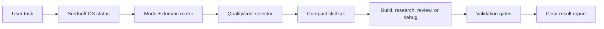

<p align="center">
  
</p>

<h1 align="center">Srednoff OS</h1>

<p align="center">
  <strong>A quality/cost-aware operating layer for Codex.</strong><br>
  Turn a fresh coding agent session into a focused engineering workflow with startup checks, skill routing, review gates, and a 3000-capability selector.
</p>

<p align="center">
  <a href="LICENSE"></a>
  
  
  
  
</p>

<p align="center">
  <a href="#quick-start">Quick Start</a>
  |
  <a href="#what-it-does">What It Does</a>
  |
  <a href="#inside-the-box">Inside The Box</a>
  |
  <a href="#safety-model">Safety</a>
  |
  <a href="INSTALL.md">Install Guide</a>
</p>

---

## Why This Exists

Codex is powerful, but every new project usually starts with the same hidden tax: rediscovering rules, choosing the right workflow, loading too much context, missing validation, and explaining quality expectations again.

Srednoff OS is a portable project layer that fixes that. It gives Codex a repeatable operating system:

- start every project with a status check;
- select only the useful skills for the task;
- route UI, 3D, SEO, mobile, programming, security, and launch work through focused gates;
- keep token cost visible instead of loading every instruction by default;
- push every task toward a tested, maintainable result.

## Quick Start

Clone the repo:

```bash
git clone https://github.com/srednoff888-art/srednoff-os.git
cd srednoff-os
```

Install globally:

```powershell
powershell -ExecutionPolicy Bypass -File ".\scripts\install-codex-md-os.ps1"
```

Initialize a project:

```powershell
powershell -ExecutionPolicy Bypass -File "$HOME\.codex\templates\codex-md-os\scripts\init-codex-project.ps1" "C:\path\to\project"
```

Verify:

```powershell
powershell -ExecutionPolicy Bypass -File "$HOME\.codex\scripts\srednoff-os-status.ps1" -ProjectPath "C:\path\to\project"
```

Expected:

```text
Srednoff OS v2.1.2 loaded: OK | project=OK | skills=<count> | kernel=3000 | selector=True
```

## What It Does

| Layer | Purpose | Result |
|---|---|---|
| Startup check | Confirms Srednoff OS is active before real work starts | Fewer broken or half-configured sessions |
| Domain router | Detects programming, UI/UX, 3D, SEO/PPC, mobile, security, launch, and migration work | Better task-specific behavior |
| Quality/cost selector | Picks a compact set from the 3000-capability kernel | More quality per token |
| Skill library | Ships reusable `SKILL.md` workflows and agent profiles | Consistent execution across projects |
| Design/source ranking | Scores UI kits, 3D sources, assets, and external component sources | Less dependency bloat and safer copying |
| Review gates | Adds security, quality, build, docs, and validation expectations | Cleaner handoff and fewer regressions |



## Inside The Box

| Path | What it contains |
|---|---|
| `AGENTS.md` | Global/project behavior contract for Codex |
| `code_review.md` | Review rules for bugs, security, performance, and maintainability |
| `.agent/` | Planning templates, quality gates, connector rules, release notes |
| `.codex/skills/` | 306 skill directories and agent profiles |
| `.codex/srednoff-os/` | Version metadata, source registry, source watchlist |
| `scripts/` | Install, sync, status, doctor, selector, router, brief, ranking, validation |
| `evals/` | Regression fixtures for selectors and routers |
| `hooks.example.json` | Portable hook example without private local state |

## Best For

- developers who want Codex to behave consistently across repos;
- teams that care about quality, validation, and token ROI;
- UI/UX and 3D web projects that need source ranking before copying components;
- SEO/PPC/growth work where research and verification matter;
- automation-heavy workflows with repeatable agent behavior.

## Safety Model

This repository is a sanitized public export. It intentionally excludes:

- real `$HOME/.codex/config.toml`;
- `hooks.state`;
- `.env` files;
- connector API keys;
- runtime caches;
- machine-specific MCP inventory;
- private local project paths.

Use `hooks.example.json` as a template. Keep real secrets in your local Codex config, shell environment, or secret manager.

## GitHub Research Notes

This README layout borrows proven open-source packaging patterns without copying code:

- centered identity and badges from popular AI tooling repos;
- fast install path before deep docs;
- explicit safety warning like MCP reference repos;
- feature table and workflow diagram for quick scanning;
- repo-health templates for easier collaboration.

## Contributing

Friends can open an issue with a skill idea, bug report, or improvement proposal. Keep contributions portable: no personal paths, no secrets, no private connector state.

See [CONTRIBUTING.md](CONTRIBUTING.md).

## License

MIT. See [LICENSE](LICENSE).
