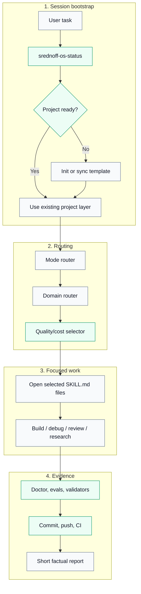
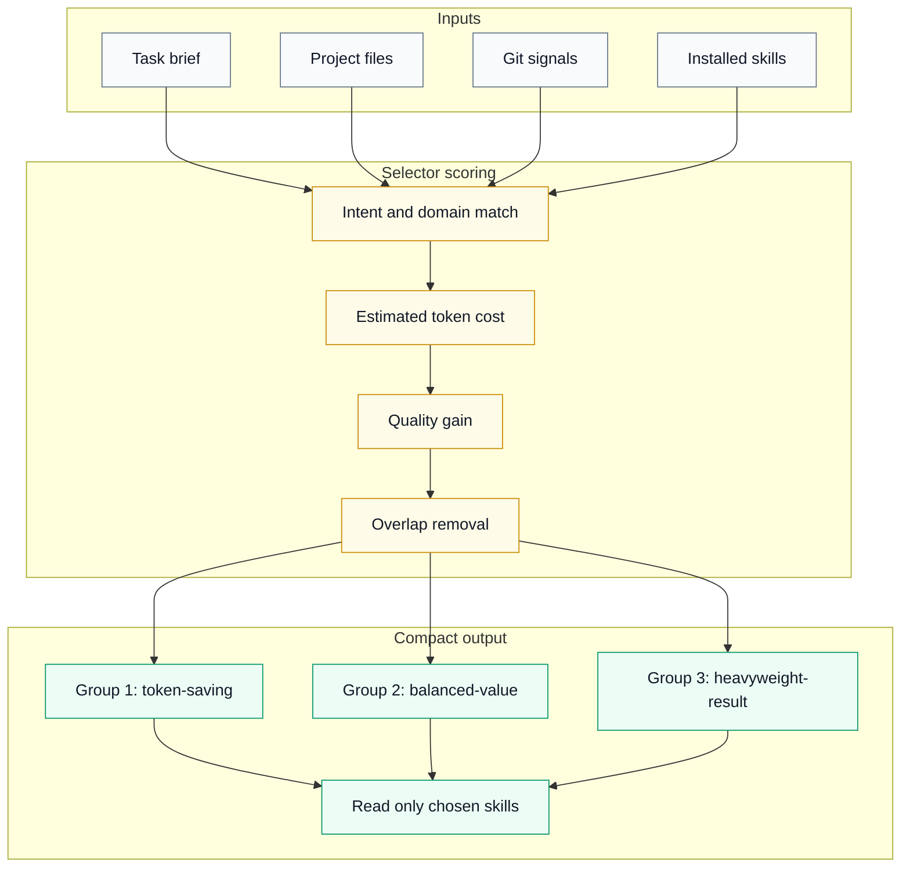
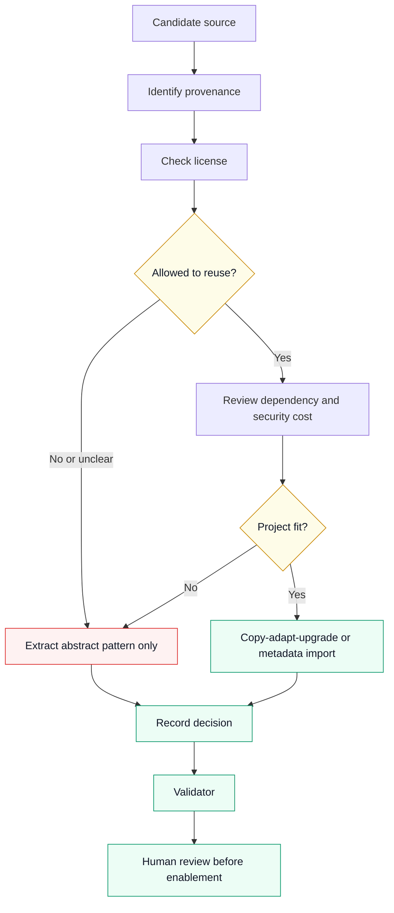

<p align="center">
  
</p>

<h1 align="center">Srednoff OS</h1>

<p align="center">
  <strong>A quality/cost-aware operating layer for Codex.</strong><br>
  Startup checks, skill routing, source provenance, safety gates, and release evidence for serious coding-agent work.
</p>

<p align="center">
  Created by <strong>Ivan Srednoff (&#1048;&#1074;&#1072;&#1085; &#1057;&#1088;&#1077;&#1076;&#1085;&#1105;&#1074;)</strong><br>
  <a href="https://srednoff.agency">Srednoff.agency</a>
</p>

<p align="center">
  <a href="LICENSE"></a>
  <a href="https://github.com/srednoff888-art/srednoff-os/actions/workflows/ci.yml"></a>
  
  
  
  
</p>

<p align="center">
  <a href="#quick-start">Quick Start</a>
  |
  <a href="#russian-version">Русская версия</a>
  |
  <a href="#architecture">Architecture</a>
  |
  <a href="#capability-map">Capability Map</a>
  |
  <a href="#release-evidence">Release Evidence</a>
  |
  <a href="#security-model">Security</a>
  |
  <a href="docs/README.md">Docs</a>
  |
  <a href="RELEASE.md">Release</a>
</p>

---

## Executive Summary

Srednoff OS turns a fresh Codex session into a repeatable engineering workflow. It keeps the startup prompt compact, then uses scripts to verify the project, route the task, select a small useful capability set, and run validation gates before shipping.

The public vNext checkpoint run is complete. Release evidence is recorded in [RELEASE.md](RELEASE.md), [QUALITY.md](QUALITY.md), and [.agent/SREDNOFF_OS_VNEXT_CHECKPOINTS.md](.agent/SREDNOFF_OS_VNEXT_CHECKPOINTS.md).

| Normal agent failure mode | Srednoff OS answer | Practical result |
|---|---|---|
| Cold project context | Startup status and project bootstrap | Fewer half-configured sessions |
| Context overload | 4500-record script-only kernel with compact selector output | Better ROI per token |
| Weak source hygiene | License, provenance, vetted, and copy-policy gates | Safer component, asset, prompt, skill, MCP, and CLI intake |
| Hidden safety gaps | Prompt/tool hooks plus deterministic fixtures | Earlier block/ask decisions |
| Unclear release quality | Doctor, evals, validators, and CI | Evidence-backed changes |
| Public/private drift | Public profiles and local overlays | Shareable repo without personal state |
| Old sessions drifting | Sync scripts with timestamped backups | New and old projects stay aligned |

## Quick Start

Clone and install:

```powershell
git clone https://github.com/srednoff888-art/srednoff-os.git
cd srednoff-os
powershell -ExecutionPolicy Bypass -File ".\scripts\install-codex-md-os.ps1"
```

Initialize a project:

```powershell
powershell -ExecutionPolicy Bypass -File "$HOME\.codex\templates\codex-md-os\scripts\init-codex-project.ps1" "C:\path\to\project"
```

Verify:

```powershell
powershell -ExecutionPolicy Bypass -File "$HOME\.codex\scripts\srednoff-os-status.ps1" -ProjectPath "C:\path\to\project"
```

Expected:

```text
Srednoff OS v2.1.2 loaded: OK | project=OK | skills=<count> | kernel=4500 | selector=True
```

## Russian Version

Srednoff OS - это инженерная надстройка для Codex, которая помогает работать не как случайный чат, а как повторяемый рабочий процесс: проверка проекта, выбор режима, подбор нужных навыков, защита от опасных действий, контроль источников и доказуемая валидация перед коммитом.

Ключевая идея: качество должно расти, но контекст не должен раздуваться. Поэтому каталог на 4500 возможностей не загружается в модель целиком. Его читает селектор, а Codex открывает только те `SKILL.md`, которые реально нужны для текущей задачи.

| Что делает Srednoff OS | Зачем это нужно |
|---|---|
| Проверяет загрузку системы в начале работы | Снижает риск работы в неподготовленной сессии |
| Инициализирует старые и новые проекты | Правила, навыки и проверки остаются одинаковыми |
| Выбирает режим и домен задачи | Малые задачи не получают лишний контекст, сложные получают усиленную проверку |
| Подбирает навыки через ROI-селектор | Больше пользы за каждый токен |
| Проверяет источники, лицензии и происхождение | Меньше риска слепого копирования компонентов, ассетов, промптов и CLI |
| Запускает doctor, evals, validators и CI | Результат подтверждается командами, а не словами |

Быстрый старт на Windows:

```powershell
git clone https://github.com/srednoff888-art/srednoff-os.git
cd srednoff-os
powershell -ExecutionPolicy Bypass -File ".\scripts\install-codex-md-os.ps1"
powershell -ExecutionPolicy Bypass -File "$HOME\.codex\scripts\srednoff-os-status.ps1" -ProjectPath "C:\path\to\project"
```

Для UI/UX, 3D, SEO/PPC, мобильных приложений, архитектуры, безопасности и production-задач система сначала маршрутизирует задачу и выбирает минимальный полезный набор навыков. Режим `TURBO` включается только literal-командой `TURBO` и означает максимальную полезную глубину проверки без отключения safety-правил.

## Architecture





Design principle: the kernel is not model context. It is a script-readable catalog. Codex reads only the selected skill files needed for the current task.

## Capability Map

| Layer | Files | Purpose | Gate |
|---|---|---|---|
| Entrypoint | `AGENTS.md` | Compact Codex operating entrypoint | Startup status |
| Rules | `.agent/*.md` | Reference docs, plans, checkpoints, quality gates | Read only when relevant |
| Skills | `.codex/skills/*/SKILL.md` | Focused capability instructions | Selector chosen |
| Kernel | `quality-cost-skill-kernel` | 4500 capability records | `validate-quality-cost-kernel.ps1` |
| Routers | `srednoff-os-mode-router.ps1`, `srednoff-os-domain-router.ps1` | Quality mode and domain routing | v2.1.1/v2.1.2 evals |
| Source ranking | `design-source-registry.json`, `srednoff-os-source-ranker.ps1` | UI/3D/component source decisions | Source registry validation |
| Security hooks | `srednoff-os-hook.ps1` | Secret/destructive/preflight gates | Security fixtures |
| Profiles | `profiles/` | Public defaults and local overlay boundary | Profile evals |
| RU layer | `policies/`, `bundles/`, `agents/`, RU CLI scripts | Russian-market risk-aware metadata | Policy, bundle, agent, RU CLI evals |
| NeuralDeep | `registry/neuraldeep/`, `integrations/neuraldeep/` | Disabled candidate metadata and controlled importer | Registry/importer evals |
| Donor research | `donor-research.json` | Prompt/source donor clean-room decisions | Donor validator |
| Documentation | `docs/`, `RELEASE.md`, `QUALITY.md` | Public evidence and usage docs | Docs validator |
| CI | `.github/workflows/ci.yml` | Windows and Ubuntu validation | GitHub Actions |

## Quality Modes

| Mode | Budget | Max capabilities | Use when |
|---|---:|---:|---|
| `fast` | lean | 8 | Tiny fixes, quick checks, low-risk docs |
| `standard` | balanced | 16 | Normal build, debug, review, refactor |
| `production` | deep | 24 | Launch, deploy, SEO/PPC/growth, mobile, 3D |
| `critical` | deep | 32 | Security, auth, data, payments, migrations, audits |
| `TURBO` | turbo | 48 | Only after the literal user command `TURBO` |

TURBO raises useful validation depth. It does not bypass destructive, paid, production, secret-sensitive, license-sensitive, or irreversible-action confirmation rules.

## Release Evidence

Current public release gate:

| Check | Result |
|---|---:|
| Srednoff OS doctor | PASS, 44/44 |
| Selector evals | PASS, 11/11 |
| v2.1.1 evals | PASS, 13/13 |
| v2.1.2 evals | PASS, 12/12 |
| Security fixtures | PASS, 12/12 |
| Profiles | PASS, 4/4 |
| Quality modes | PASS, 5/5 |
| Policies | PASS, 5/5 |
| Bundles | PASS, 9/9 |
| Agents | PASS, 8/8 |
| RU CLI | PASS, 4/4 |
| NeuralDeep registry | PASS, 5/5 |
| NeuralDeep importer | PASS, 5/5 |
| Kernel | PASS, 4500 records |
| Source registry | PASS, 17 sources |
| Donor research | PASS, 3 sources |
| Docs | PASS, 8 files |
| Skill metadata smoke | PASS, 308/308 |
| GitHub Actions | PASS, Windows and Ubuntu |

Release details:

- [Public release note](RELEASE.md)
- [Quality evidence](QUALITY.md)
- [Changelog](CHANGELOG.md)
- [Checkpoint report](.agent/SREDNOFF_OS_CHECKPOINT_14_RELEASE.md)

## Security Model

Srednoff OS treats external sources and tool actions as supply-chain inputs.

| Risk surface | Posture |
|---|---|
| Secrets | Block high-confidence tokens, keys, cookies, and private material |
| Destructive commands | Block or ask before local or production damage |
| External installs | Ask before package, MCP, CLI, or tool installation |
| Prompt/donor repos | Extract abstract patterns only; no verbatim leaked prompt reuse |
| UI/3D assets | Verify provenance, license, dependency weight, accessibility, and performance |
| NeuralDeep candidates | Disabled and untrusted until item-level human review |
| RU regulated workflows | Conservative review gates; not legal advice |

Hooks reduce accidental misuse. They do not replace sandboxing, OS permissions, secret managers, legal review, or human approval.

## Source Intake Policy



Allowed: pattern extraction, metadata, small project-fit adaptations after review.

Blocked: blind copying, unreviewed installs, prompt-leak text reuse, hidden-policy reconstruction, and enabling untrusted MCP/CLI tools.

## Documentation

| Topic | Link |
|---|---|
| Documentation index | [docs/README.md](docs/README.md) |
| Architecture | [docs/architecture.md](docs/architecture.md) |
| Security | [docs/security.md](docs/security.md) |
| Workflows | [docs/workflows.md](docs/workflows.md) |
| Profiles | [docs/profiles.md](docs/profiles.md) |
| RU and NeuralDeep | [docs/ru-and-neuraldeep.md](docs/ru-and-neuraldeep.md) |
| Risk model | [docs/risk-model.md](docs/risk-model.md) |
| Validation | [docs/validation.md](docs/validation.md) |

## Repository Layout

| Path | Contents |
|---|---|
| `AGENTS.md` | Compact Codex operating entrypoint |
| `code_review.md` | Review stance and issue-first review behavior |
| `.agent/` | Plans, rules, checkpoint reports, public/private boundary |
| `.codex/skills/` | Skill definitions and agent profiles |
| `.codex/srednoff-os/` | Version, source registry, watchlist, donor research |
| `docs/` | Public documentation portal |
| `profiles/` | Public profile metadata and sanitized overlay examples |
| `policies/` | RU and NeuralDeep policy gates |
| `bundles/` | Disabled RU domain bundle presets |
| `agents/` | Disabled RU specialist role lenses |
| `registry/neuraldeep/` | Disabled NeuralDeep candidate registry |
| `integrations/neuraldeep/` | Controlled metadata importer |
| `scripts/` | Install, sync, status, doctor, selector, routers, validators |
| `evals/` | Regression fixtures |
| `.github/workflows/ci.yml` | Cross-platform validation |

## What It Is Not

| Not promised | Reality |
|---|---|
| A stronger model | It is an operating layer around Codex behavior |
| Mathematical obedience | It improves routing, checks, and evidence but cannot guarantee model behavior |
| A secret manager | It detects likely leaks; secrets still belong in proper stores |
| Legal clearance | It records provenance and forces review; humans approve legal risk |
| A reason to load everything | The selector exists to keep context small |

## Best For

| User | Fit |
|---|---|
| Solo developer | Wants Codex to behave consistently across projects |
| Small team | Needs repeatable rules, quality gates, and contribution hygiene |
| UI/UX or 3D web builder | Needs source ranking before copying components or assets |
| SEO/PPC/growth operator | Needs research discipline and validation gates |
| Automation-heavy workflow owner | Needs hooks, sync scripts, evals, and templates |

## License

MIT. See [LICENSE](LICENSE).
