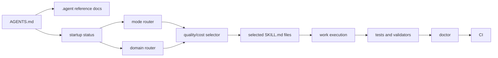
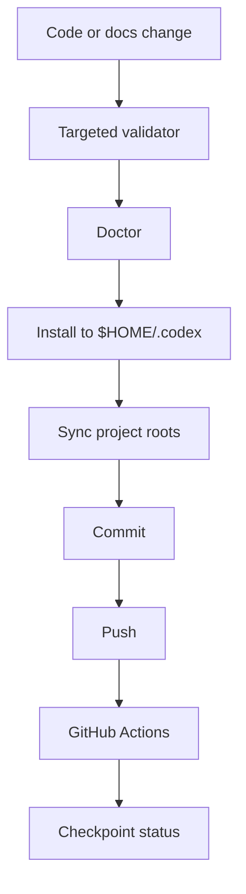

# Architecture

Srednoff OS is a portable operating layer for Codex. It is intentionally split into a compact entrypoint, scriptable selectors, small skill reads, and validation gates.

## System Map

## Ownership Boundaries

| Layer | Files | Ownership | Loaded by default |
|---|---|---|---|
| Entrypoint | `AGENTS.md` | Public core | Yes |
| Reference rules | `.agent/*.md` | Public core | Only when relevant |
| Skills | `.codex/skills/*/SKILL.md` | Public core | Selector-chosen only |
| Kernel | `.codex/skills/quality-cost-skill-kernel/references/core-3000-capabilities.json` | Script-only public catalog | No |
| Runtime scripts | `scripts/*.ps1`, `scripts/*.sh` | Public core | Called by workflow |
| Profiles | `profiles/` | Public defaults and examples | Metadata only |
| Policies | `policies/` | Public gates | Script-selected |
| Registries | `.codex/srednoff-os/`, `registry/` | Public metadata | Validators read |
| Local state | `$HOME/.codex/*`, logs, hooks config | User machine | Never committed |

## Startup Flow

1. `AGENTS.md` tells Codex to run `srednoff-os-status.ps1`.
2. The status script verifies project files, skill index, kernel size, and selector availability.
3. Substantial work runs `srednoff-os-mode-router.ps1`, `srednoff-os-domain-router.ps1`, and `select-quality-cost-capabilities.ps1`.
4. The selector returns a compact set of capabilities and mapped skills.
5. Codex reads only relevant `SKILL.md` files.

The 4500-record kernel stays script-only. Loading it into model context is a bug unless the task is explicitly auditing the catalog.

## Capability Selection

| Group | Cost posture | Use |
|---|---|---|
| Group 1 | Token-saving | Prefer first for context mapping, inventories, and quick checks |
| Group 2 | Balanced value | Use when implementation or validation quality improves materially |
| Group 3 | Heavyweight result | Use for high-risk architecture, security, production, migrations, or explicit `TURBO` |

The selector preserves the legacy non-overlap principle: if two capabilities solve the same failure mode, keep the narrower one with stronger project fit.

## Release Evidence Path

Every checkpoint must be auditable through files, local commands, and GitHub Actions.

