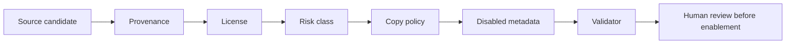

# Workflows

## Normal Project Workflow

1. Run startup status.
2. Inspect the repository before editing.
3. Run mode/domain routers for substantial work.
4. Run the quality/cost selector and read only selected skills.
5. Implement the smallest production-ready change.
6. Validate with targeted tests and relevant gates.
7. Report changed files, commands, risks, and next steps.

## Srednoff OS Maintenance Workflow

```powershell
powershell -ExecutionPolicy Bypass -File ".\scripts\srednoff-os-doctor.ps1" -ProjectPath . -RunEvals -FixSafe
```

Maintenance changes must update release evidence when they affect public behavior:

- `README.md`;
- `QUALITY.md`;
- `CHANGELOG.md`;
- `.agent/SREDNOFF_OS_VNEXT_CHECKPOINTS.md`;
- matching checkpoint notes under `.agent/`.

## Checkpoint Workflow

1. Pick one checkpoint.
2. Keep scope narrow.
3. Add or update deterministic validation.
4. Run local validation.
5. Install into `$HOME/.codex`.
6. Sync old project roots when relevant.
7. Commit and push.
8. Wait for GitHub Actions.
9. Mark checkpoint done only after green CI.

## TURBO Mode

`TURBO` is active only when the user literally writes `TURBO`.

In TURBO, Srednoff OS may use more expensive validation, top-source benchmarking, multi-pass review, and broader selected skills. It still does not allow destructive, paid, production, account-changing, secret-sensitive, or irreversible actions without explicit confirmation.

## External Source Intake

Use this flow for donor repos, UI kits, 3D assets, skills, agents, MCP servers, CLIs, and prompt archives:



